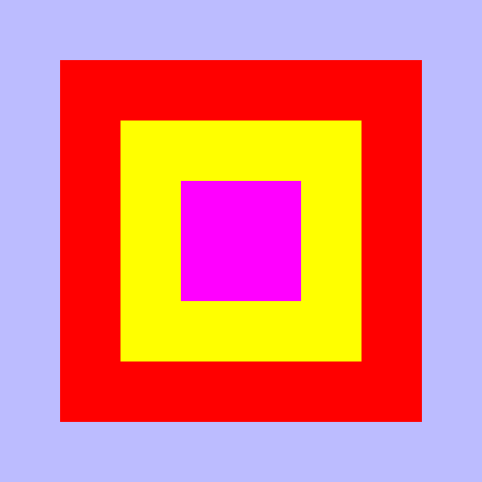
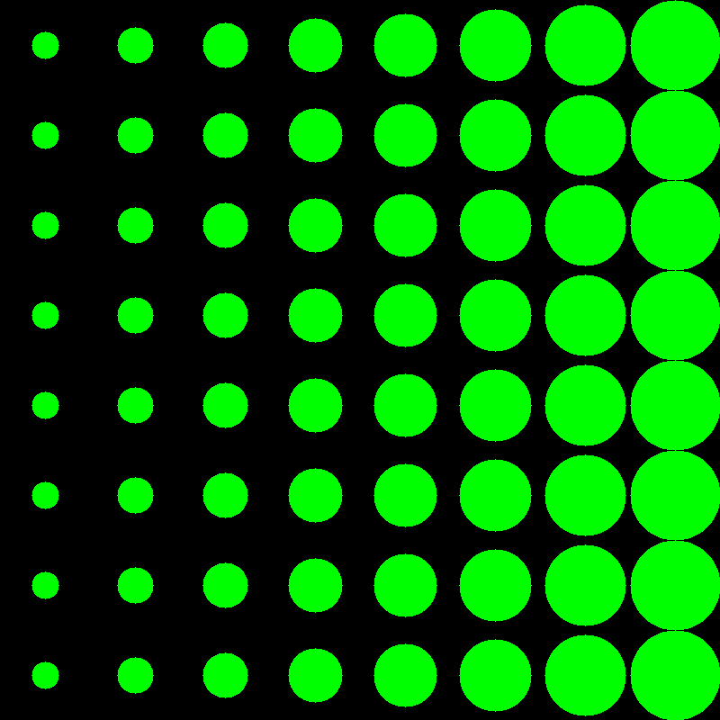
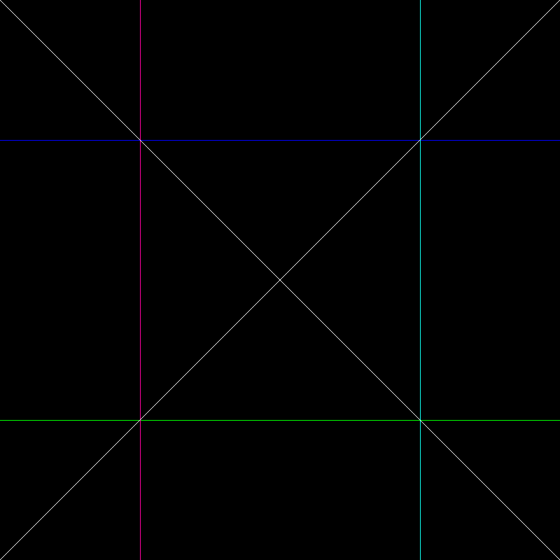

A tiny graphics library for coloring pixels.

## Build

To build the library, simply run the following command:

```
./build.sh
```

## Run Examples

You can run the example with the following command:

```
cd dist && ./main
```

## Examples

### Rectangles

```cpp
    size_t width = 800, height = 800;
    const char *rectanglesFileName = "rectangles.ppm";

    Px::Surface *surface = Px::Surface::create(width, height);
    Px::fill(surface, 0x00FFBCBC);

    Px::Rectangle rect = { .width = 600, .height = 600, .x = 100, .y = 100 };
    Px::fill_rectangle(surface, &rect, 0x000000FF);

    rect.width = rect.height = 400;
    rect.x = rect.y = 200;

    Px::fill_rectangle(surface, &rect, 0x0000FFFF);

    rect.width = rect.height = 200;
    rect.x = rect.y = 300;

    Px::fill_rectangle(surface, &rect, 0x00FF00FF);
    Px::Errno err = Px::save_as_ppm(surface, rectanglesFileName);
```



### Circles

```cpp
    size_t width = 800, height = 800;
    const char *circlesFileName = "circles.ppm";

    Px::Surface *surface = Px::Surface::create(width, height);
    Px::fill(surface, 0x00000000);
    Px::Circle circle = { .radius = 10, .x = 0, .y = 0 };

    for (int x = 0; x < width; x += 100) {
        circle.x = x + 50;
        circle.radius = circle.radius + 5;

        for (int y = 0; y < height; y += 100) {
            circle.y = y + 50;

            Px::fill_circle(surface, &circle, 0x0000FF00);
        }
    }

    Px::Errno err = Px::save_as_ppm(surface, circlesFileName);
```



### Lines

```cpp
    size_t width = 800, height = 800;
    const char *circlesFileName = "circles.ppm";

    Px::Surface *surface = Px::Surface::create(width, height);
    Px::fill(surface, 0x00000000);

    Px::Line line = { .x1 = 0, .y1 = 200, .x2 = 799, .y2 = 200 };
    Px::draw_line(surface, &line, 0x00FF0000);

    line.y1 = line.y2 = 600;
    Px::draw_line(surface, &line, 0x0000FF00);

    line.y1 = 0;
    line.y2 = 799;
    line.x1 = line.x2 = 200;
    Px::draw_line(surface, &line, 0x00A000FF);

    line.x1 = line.x2 = 600;
    Px::draw_line(surface, &line, 0x00F0FF0F);

    line.x1 = line.y1 = 0;
    line.x2 = line.y2 = 799;
    Px::draw_line(surface, &line, 0x00FFFFFF);

    line.x1 = line.y2 = 799;
    line.x2 = line.y1 = 0;
    Px::draw_line(surface, &line, 0x00FFFFFF);

    Px::Errno err = Px::save_as_ppm(surface, lineFileName);
```


